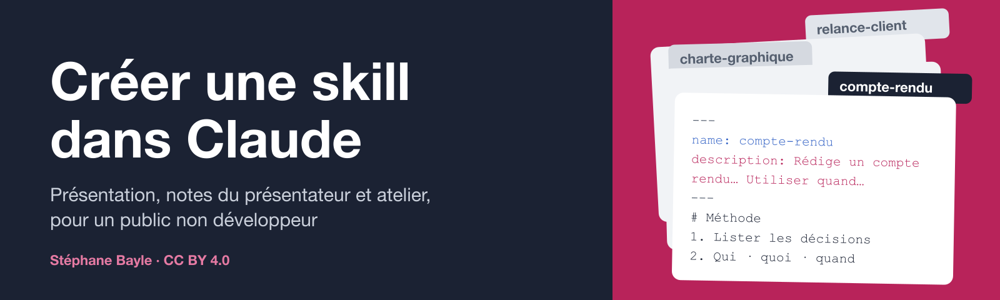

# Créer une skill dans Claude

Supports d’une séance d’environ 55 minutes pour un public **non développeur**, suivie d'un atelier :
qu'est-ce qu'une skill, projet ou skill, où les trouver, **Chat, Cowork ou Code** (avec le **mode plan**),
comment en créer une, comment la partager, puis un quiz oral avec la salle.

Auteur : **Stéphane Bayle** · stephane.bayle@gmail.com ·
[LinkedIn](https://www.linkedin.com/in/stephanebayle/) · [GitHub](https://github.com/StephaneBayle)

## Les documents

| Fichier | Pour quoi faire |
|---|---|
| [`skills-claude-presentation.pptx`](skills-claude-presentation.pptx) | La présentation (52 diapos, 16:9), notes du présentateur incluses dans chaque diapo |
| [`skills-claude-notes-presentateur.pdf`](skills-claude-notes-presentateur.pdf) | Le document à distribuer : notes diapo par diapo, glossaire, fiches pas-à-pas, corrigé du quiz, atelier |
| [`skills-claude-notes-presentateur.docx`](skills-claude-notes-presentateur.docx) | La même chose en Word, pour l'adapter |

Pour l'atelier, commencez par les **fiches B4** (créer une skill dans Chat ou Cowork), **B7**
(créer une skill avec Claude Code, sans terminal) et **B8** (skill-creator, la skill d'Anthropic qui fabrique
les skills) du document distribué.

## Aller plus loin

- [Utiliser les skills dans Claude](https://support.claude.com/en/articles/12512180-use-skills-in-claude) (aide officielle)
- [Cas d'usage Claude Academy : empaqueter sa charte de marque dans une skill](https://academy.claude.com/fr/use-cases/package-your-brand-guidelines-in-a-skill)
- [Skills d'exemple d'Anthropic](https://github.com/anthropics/skills)
- [Le mode plan de Claude Code](https://code.claude.com/docs/en/permission-modes)

Ces supports décrivent Claude tel que documenté en septembre 2026 ; les menus et les offres évoluent.
En cas de doute, l'aide officielle de Claude fait foi.

## Régénérer ou adapter

Tout est produit à partir de deux fichiers : [`sources/content.js`](sources/content.js) (textes des diapos et des notes)
et [`sources/tokens.json`](sources/tokens.json) (charte graphique). Voir [`sources/README.md`](sources/README.md) et
[`sources/DESIGN.md`](sources/DESIGN.md). Sur un Mac avec Node, Python 3.12, Keynote et Pages :

```bash
sources/build_all.sh
```

## Licences

- **Supports pédagogiques** (présentation, notes du présentateur PDF et Word, et textes de
  `sources/content.js`) : [Creative Commons Attribution 4.0 International (CC BY 4.0)](LICENSE).
  Vous pouvez les réutiliser, les adapter et les diffuser, y compris commercialement, à condition de créditer
  l'auteur, d'indiquer le lien vers ce dépôt et de signaler vos modifications.
  Crédit suggéré : *« Créer une skill dans Claude », Stéphane Bayle, CC BY 4.0,
  github.com/StephaneBayle/creer-une-skill-claude*.
- **Code de génération** (scripts du dossier `sources/` : `*.js`, `*.py`, `*.sh`, `tokens.json`, `package.json`),
  à l'exception des textes de `sources/content.js` : [licence MIT](LICENSES/MIT.txt).

Les marques citées (Claude, Anthropic, GitHub…) appartiennent à leurs propriétaires ; ces supports n'en sont pas
affiliés. Les ressources externes citées (aide Claude, Claude Academy) restent sous leurs propres conditions.
